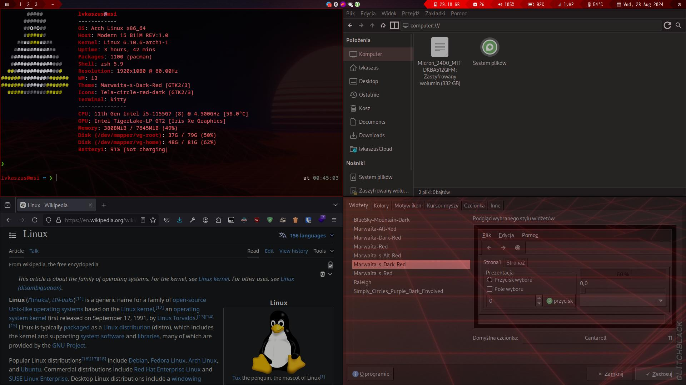

<h1>My Arch Linux Dotfiles</h1>

My Arch Linux configuration files (dotfiles) for i3 Window Manager!

<h2 align="center">Installation</h2>

- Install all the required packages from the `packages.txt` text file. (⚠️ Recommended to use `yay` Package Manager!)
- Adjust configuration files to your needs.
- Copy all the files and directories from the repository directories.
- Enable all the required system services.
- Restart your running Arch Linux installation.
- Enjoy! 😄️

<h2 align="center">Credits</h2>

- This repository uses Tela Circle Icon Theme (https://github.com/vinceliuice/Tela-circle-icon-theme)
- This repository uses Marwaita Red Theme (https://github.com/darkomarko42/Marwaita-red)
- This repository uses Shapes Polybar Theme (https://github.com/adi1090x/polybar-themes)
